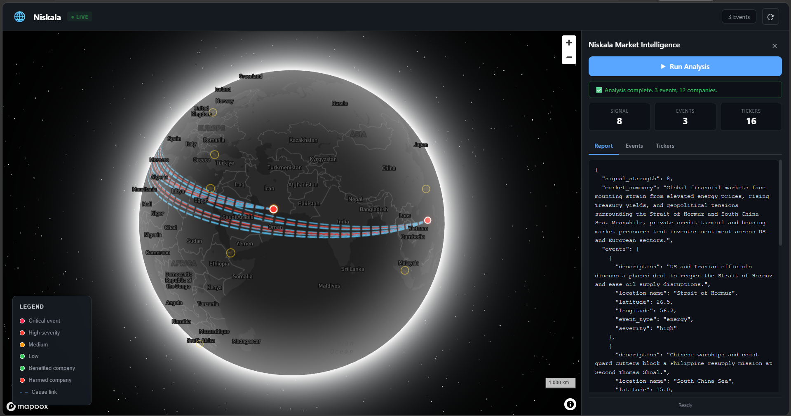
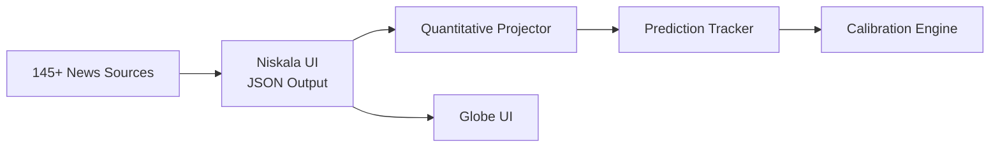

# 🌐 Niskala

**AI-Powered Market Intelligence on a 3D Globe**

Niskala reads 145+ global news sources in real-time, analyzes them with a 4-stage agentic AI workflow, and visualizes cause-and-effect market impacts on an interactive 3D globe.

## ✨ Features

- 📰 **145+ RSS feeds** + OSINT aggregation
- 🧠 **4-stage agentic workflow** (Langflow)
- 📊 **Quantitative projections** with 80% confidence intervals
- 🔄 **Self-calibrating** — learns from prediction accuracy
- 🌍 **3D globe visualization** with cause-effect chains
- ⚡ **Ultra-lightweight UI** (~120 KB, zero dependencies)

## 🏗️ Architecture

## 🙏 Credits
Built with Langflow

Maps by Mapbox

Name inspired by Javanese Kuna philosophy: niskala = the unseen realm

Inspired by https://github.com/unicodeveloper/globalthreatmap